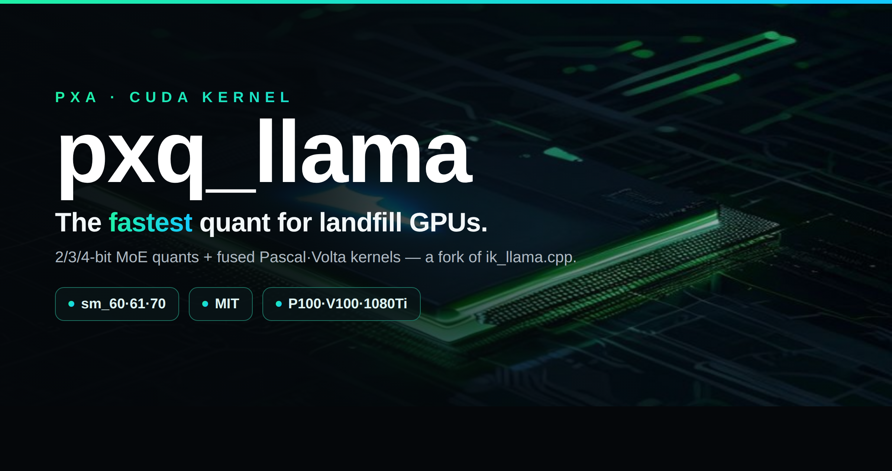
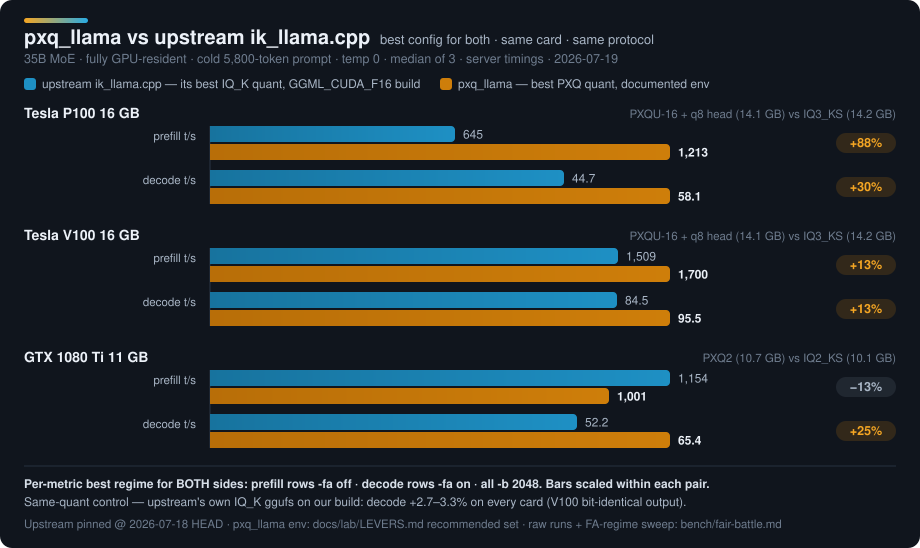

<!-- GitHub README for the kernel repo (pxq_llama, a fork of ik_llama.cpp). -->
<p align="center"></p>

# pxq_llama — run PXQ-quantized models (revive your landfill GPUs)

> Authored and maintained by **PXA Network** (https://pxanetwork.com) — the creator of pxq_llama and the PXQ/PXA kernel family.

**Community: [Discord — PXA Network](https://discord.gg/BHWmMHHStY)** — support, benchmark wall, dev talk. Release notes post there automatically.

A fork of [ik_llama.cpp](https://github.com/ikawrakow/ik_llama.cpp) — a **general MoE accelerator for
Pascal/Volta silicon** (and modern cards), plus **PXQ**, a family of PXA-native low-bit quants.

> **Upstream base:** this fork is based on **ikawrakow/ik_llama.cpp @ `1520eda98056`** (2026-06-04,
> _"prompt cache: Fix assertion ... (#1913)"_), developed independently since (PXQ tiers + ENHANCE +
> MoE/kernel fixes on top). The repo history is flattened, so there is **no git merge-base** with
> upstream — to diff or cherry-pick, compare against upstream at that exact commit. The
engine work — an sm_60 fp16-GEMM gate fix, a flash-attention regime fix, MoE-path fixes, and correct
`np>1` hybrid concurrency — speeds up **any** MoE on these cards, at any size, and it **scales from one
salvaged card to a multi-card `-sm layer` spread to CPU/RAM offload**. So it runs a **35B on a single
12–16 GB card**, and it runs **120B / 122B-class MoEs** across a stack of old Teslas — faster than
mainline ik in every config measured so far. Built to give old hardware a second life instead of the
e-waste bin.

> **The single-card 35B below is the reproducible proof-of-concept** — one $150 card, one downloadable
> GGUF, a chart you can rebuild. It's the on-ramp, not the ceiling: the same engine + PXQ tiers carry
> straight up to big multi-card MoEs (a published multi-card bench is coming; today those wins are
> measured, not yet charted here).

Models: **https://github.com/poisonxa16/pxq_llama** ← you are here · Weights: [huggingface.co/poisonxa](https://huggingface.co/poisonxa)

> 💛 Support: **https://ko-fi.com/shatteredrealms1**

## Head-to-head vs upstream ik_llama.cpp

Best config for **both** sides — upstream at its own documented best (its best-fitting IQ_K quant,
`GGML_CUDA_F16` build), pxq_llama at its documented best (`docs/LEVERS.md`). Same card, same cold
5.8k-token prompt, temp 0, median of 3. Full methodology + raw runs: [`bench/fair-battle.md`](bench/fair-battle.md).

<p align="center"></p>

## PXQ vs MXFP4 — every cell we measured, including the one we lose

> **⚠ CORRECTION (2026-07-29): the MoE decode row has been withdrawn, the MoE prefill row has
> been relabelled (‡), and the rest of this table is pending re-verification.** On
> re-measurement the published MoE-decode figure did not reproduce, and the artifact behind both
> MoE rows was found not to match its label. Details in "Withdrawn: MoE decode" below. We would
> rather publish the correction than leave a number up that we can no longer stand behind.

Same engine, same cards, same protocol. Dense = Qwable-27B,
MoE = Fusion4-35B, `llama-server /completion`, temp 0, coherence-gated, n=7, median reported.

| cell | PXQ4 | MXFP4 | result |
|---|---|---|---|
| ~~**MoE decode**, 2×V100~~ | ~~104.06~~ | ~~96.59~~ | **WITHDRAWN — see below** |
| **MoE prefill**, 2×V100 ‡ | 1394.0 | 1172.8 | **+18.9%** |
| **Dense prefill**, 2×V100 † | 543.9 | 265.6 | **+104.8%** |
| **Dense prefill**, 2×P100 † | 128.0 | 107.4 | **+19.2%** |
| **Dense decode**, 2×P100 † | 15.18 | 14.32 | **+6.0%** |
| **Dense decode**, 2×V100 *(default)* † | 29.79 | 36.40 | **−18.2%** ← we lose this one |
| **Dense decode**, 2×V100 *(with opt-in `PXA_PXQ_MMVQ=1`)* † | 33.82 | 36.38 | **−7.0%** |

### Withdrawn: MoE decode (was 104.06 vs 96.59, "+7.7%")

Re-running the exact published artifact in the exact published cell
(`-c 8192 -b 512 -ub 512`, temp 0, `/completion`, 2×V100, n=7 median, prompt fill 6018):

| binary | MMVQ off | MMVQ on |
|---|---|---|
| pre-canon | **93.19** | 92.82 |
| current   | 91.39 | 90.84 |

**93.19, not 104.06.** The MXFP4 side of the comparison reproduces across builds (96.59 → 94.54);
the PXQ4 side does not. Two candidate explanations were tested and both failed: the bit-exactness
rework costs only 1.9%, and `PXA_PXQ_MMVQ` is a no-op on this file (−0.4%).

The cause turned out to be the artifact, not the kernel. Its tier table:

```
attn    : MXFP4:82
shexp   : MXFP4:123
exps    : MXFP4:3 / PXQ4:120
ssm_out : MXFP4:30
```

Full census: `F32:308  MXFP4:300  PXQ4:120  Q8_0:23  F16:2` — 753 tensors, 443 quantized.
**Only 120 of the 443 quantized tensors (27%) are PXQ4**, and attention and the shared expert
carry none. So that row did not compare PXQ4 against MXFP4; it compared *MXFP4-with-PXQ4-experts*
against *MXFP4*. It also explains the MMVQ null: only `PXQ4`/`PXQ4HQ` gain from that flag, and
MXFP4 is already on the same kernel path.

**‡ The MoE *prefill* row is measured on that same artifact.** The number reproduces — the label
does not. With only 120 of its 443 quantized tensors PXQ4, and attention and the shared expert
still MXFP4, **+18.9% is an expert-codec prefill delta — *MXFP4-with-PXQ4-experts* vs *MXFP4*,
not whole-model PXQ4 vs MXFP4.** Read it as that narrower claim. It gets re-run against an MoE
artifact that is PXQ4 throughout, at which point it either becomes a whole-model number or it
doesn't.

**† The dense rows: audited, and the artifacts are sound — but the comparison's identity is not
recorded.**

| artifact | quantized tensors | PXQ share |
|---|---|---|
| `Qwable-27B-PXQ4core` | 470 | 69% |
| `Qwable-27B-MXFP4-lite` | 470 | 0% |
| `Qwable-27B-MXFP4-legacy` | 506 | 0% |

`PXQ4core` and `MXFP4-lite` are a properly matched pair: identical tensor counts and identical
`Q8_0`/`Q6_K` promotions, with exactly 325 tensors differing and only in codec. `MXFP4-legacy` is
**not** matched — it has 36 more quantized tensors and lacks those promotions.

The published table does not say which of the two MXFP4 files the dense rows used. Against `lite`
they are sound; against `legacy` they confound codec with backbone allocation. The rows stay
daggered until re-run against a named file — not because they are known wrong, but because we
cannot currently prove which comparison was made.

Nothing here is a claim that PXQ regressed: the corrected MoE-decode figure matches the current
build within measurement noise.

**The loss is real and we are not going to hide it.** On Volta (sm_70), dense-model *decode* is
~7% slower on PXQ4 than MXFP4. The cause is understood: MXFP4's block layout maps onto DP4A with a
single scale fixup per 32-value block, while PXQ4's sub-scale hierarchy costs a second fixup chain
and a second cache sector for the scale. It has survived roughly eight distinct kernel-side attacks
across three separate optimization passes — including a rewritten `vec_dot` that we built, measured,
and **reverted** when it came in slightly worse (see the revert commit, which carries its own
numbers). At equal bit width against a kernel already running at ~76% of HBM peak, the ceiling is a
tie, not a win.

**What you get for those 7%:**

| | MXFP4 | PXQ4 |
|---|---|---|
| nominal | 4.25 bpw | 4.25 bpw |
| **effective** | **3.64 bpw** | **4.25 bpw** |
| reconstruction error | baseline | **38% lower** |
| **perplexity** (paired, same bytes) | **6.9704** | **6.5527 — −6.0%** |

MXFP4 occupies 4.25 bits but spends none of them protecting salient weights. PXQ4 does, and it
shows up where it matters. **On that one cell the trade is ~7% decode speed for ~6% perplexity at
identical file size.** Whether that is worth it is your call, not ours — which is why the table
above exists.

### Which should you actually run?

| your setup | honest answer |
|---|---|
| **MoE** (any size) | **PXQ4** — prefill win measured, but as an expert-codec delta (‡ above). **No MoE decode comparison currently stands** — the published one is withdrawn. Fidelity vs MXFP4 measured on dense, not yet on MoE |
| **Pascal** (P100/GP100) | **PXQ4** — faster on both axes; dense fidelity measured (below) |
| **Dense, long prompts / agentic** | **PXQ4** — ~2× prefill, better quality |
| **Dense, decode-bound, on Volta** | **MXFP4 is faster.** Take PXQ4 only if you want the fidelity |

## Bonus: this fork speeds up quants we did not invent

Several fixes in this fork are **not PXQ-specific** and benefit any quant on these cards: an sm_60
fp16-GEMM gate that wrongly excluded GP100 (full-rate fp16 silicon that was taking the fp32 path), a
flash-attention regime fix, MoE-path fixes, and correct `np>1` hybrid concurrency that upstream
corrupts. The upstream head-to-head above is measured on **upstream's own best IQ_K quant**, not on
PXQ — that comparison is the evidence for this claim.

⚠ **What we have NOT isolated:** we measured a same-file MXFP4 A/B (Fusion4-35B, 2×V100) at
**+2.7% prefill / +7.6% decode**, but the two builds span ~9 days of commits, so that delta is
**not attributable to any single fix** and we are not presenting it as one. The specific
`op_params` precision-alias fix from this cycle is recorded in our own notes as leaving MXFP4
**unchanged** — its guard is PXQ-scoped. A clean per-fix attribution for non-PXQ codecs has not
been done.

## Updates — 2026-07-30

**A decode path for the 1-bit tier, model-adaptive lever selection, a round of robustness work —
and a set of documentation corrections, including one lever that shipped default-ON while the docs
said it did not exist.**

- **PXQ1 (the 1-bit tier) now reaches a real decode dispatch path** instead of falling back to
  dequant + cuBLAS every token. Measured on a 122B-A10B PXQU24 artifact: decode **11.8 → 36.0 t/s**.
  Also fixes an out-of-bounds code-row read when `CODE_WORDS == 1` — which is exactly the PXQ1
  geometry. Gated by **`PXA_PXQ1` (default ON)**; `=0` returns to the dequant/cuBLAS fallback, and
  a one-shot sign-book self-check disables the fused path on its own if it ever fails.
- **`PXA_ENHANCE=1` is now (device × model) adaptive, and prints a decision ledger.** Lever
  selection reads the loaded model's tensor census as well as the device fleet, and every auto-set
  decision is printed at startup with its reason — so the configuration actually in force is
  auditable instead of inferred. Concretely: `PXA_PXQ_GEMM_2D` auto-arms only for sm_60 × dense ×
  PXQ-bearing tensors rather than on device class alone, and `PXA_PXQ_MMVQ` auto-arms only on a
  PXQ4/PXQ4HQ-bearing model with a DP4A-capable device.
- **Env gates are value-tested, not presence-tested.** `PXA_FOO=0` now *disables* a lever instead
  of enabling it by virtue of being set — which is what every operator already assumed it did.
- **The server now survives things that used to take it down.** An unsampleable distribution (in
  practice a NaN cascade from invalid logits) used to `GGML_ABORT` the whole process, killing every
  co-resident generation over one poisoned slot; it now keeps the forensic dump, falls back to the
  finite argmax and degrades only that request (`PXA_SAMPLE_ABORT=1` restores the fatal behaviour).
  A generation cut mid-codepoint no longer 500s an otherwise successful request — the final
  response holds back an incomplete trailing UTF-8 sequence, as the streaming path already did.
  The abort-path backtrace no longer forks, which used to leave a deadlocked orphan holding the
  listening socket. New: a **port guard** that refuses to start when a live listener already
  answers on the target port, and names the cause (`PXA_PORT_GUARD=0` bypasses); and
  **container-aware wedge handling** — exit-and-let-the-orchestrator-restart is only a valid
  contract when an orchestrator exists, so bare metal gets an in-process recovery attempt and a
  distinct exit code instead (`PXA_IN_CONTAINER=0|1` overrides the detection). Hybrid-recurrent
  checkpoint rollback is fixed (`PXA_CKPT_HYBRID_ROLLBACK`).
- **The PXQ repetition guard is now PXQ1-scoped.** Arming it on any PXQ artifact was the root cause
  of the reported arithmetic flips on sm_61: a guard aimed at 1-bit degeneration was penalising
  correct repeated digits in ordinary output.
- **`llama-quantize` now fails loudly instead of quietly.** All twelve `--*-type` flags assigned the
  parse-failure value unconditionally and the consumer guard then skipped the flag in silence —
  exit 0, clean logs, and a different model than the one you asked for. Type names are now matched
  case-insensitively and an unparseable one is a hard failure. `--custom-q` demotions are reported
  per tensor and summarised at end of run (a silent demote is how a measurement arm ends up
  measuring nothing). New selectors: **`PXA_PXQ_KV`** (`q8_0`|`pxq4`|`pxq4hq`|`pxq6`|`mxfp4`,
  default `q8_0`) for `attn_k`/`attn_v`/`attn_v_b`, and a `core` token for **`PXA_PXQ_BACKBONE`** —
  both were described in the lever docs before they existed in source; this lands them.
- **Upstream ports, all default-off or fix-only** (ik_llama.cpp #2057/#2102, #1967/#1969, #1918,
  #2181, #2188, #2018, #2129): opt-in parallel weight loading for `--no-mmap`
  (**`PXA_PARALLEL_LOAD=N`** — unset/0 keeps the serial path, `1` selects the upstream default of 8
  workers, `2..64` an explicit count; with mmap the upstream rewrite serializes every tensor behind
  one mutex, so that path is kept serial and the loader warns once); stb_image_resize2 SIMD
  resizers plus the reference bicubic Qwen-VL / Gemma4V preprocessing (**`PXA_MTMD_STBIR=1`** — one
  switch, because the reference "bicubic" is a filtered Catmull-Rom that only the stbir path
  provides); an MTP draft-gen KV-reserve clamp (**`PXA_MTP_DRAFT_RESERVE_CLAMP`**, default off); a
  deepstack image-embedding stride OOB; and three `common/` correctness fixes — sampler
  out-of-bounds on vocabularies with no newline token, a jinja for-loop scope leak
  (`PXA_JINJA_LEGACY_LOOP_SCOPE` restores the old behaviour), and a boolean flag swallowing the
  following argv entry.
- **New (opt-in): `PXA_FA_MASK_SKIP_TILE_F32`** — skip fully-masked KV tiles in the tile-f32
  flash-attention kernel. Fully-masked tiles contribute exactly zero, so the skip is bit-identical.

**Documentation corrections shipped with this release** (details in `docs/LEVERS.md`):

- **`PXA_PXQ1` was documented as "no fused kernel family, no env gate (nothing to disable)".** It is
  a real default-ON gate over a fused kernel family. The row now says so, and carries the measured
  decode figure with the exact cell it was measured on.
- **`PXA_FA_MASK_SKIP_TILE` does not engage on sm_61.** The dispatch reaches the tile-f16 kernel the
  skip lives in on **sm_60 only**, and then only at `GGML_PREC_DEFAULT` with Q rows > 8 and head-dim
  ≠ 256. The sm_61 startup banner used to report the lever ON regardless; that phantom report is
  gone. On sm_61 and on the F32-precision path the equivalent is the opt-in
  `PXA_FA_MASK_SKIP_TILE_F32` above.
- **`PXA_FA_PREFILL_SPLIT` has no auto-default.** The resolver returns 0 at every level and posture
  unless the env is set — the non-FA prefill chain inflates the compute buffer ~2.35× and OOMs
  16 GB cards at ub2048 — so the earlier BALANCE/ENHANCE auto-default was withdrawn (2026-07-24)
  and the docs now match the source. `PXA_MODE` no longer moves any kernel-lever default either;
  its only consumers are the mode name and the startup report.
- **The CUDA-graph knobs are inventoried per knob** (`PXA_CUDA_GRAPH_MOE`, `_LRU`, `_REARM`,
  `_BATCH_MAX_NY`), along with `PXA_PXQ_DISPATCH_DBG` — each labelled *unmeasured* or
  *diagnostic-only* rather than handed a number it does not have.
- **The MoE codec comparison is corrected**: the decode figure is withdrawn and the prefill figure
  is relabelled as an expert-codec delta. See the table and its ‡/† footnotes above.

## Updates — 2026-07-28

**Four engine fixes, one new opt-in lever, and one optimization we reverted after measuring it.**

- **Quantizer threaded over `(expert, panel-chunk)`.** It previously threaded over experts only, so
  a *dense* model (`E==1`) quantized single-threaded: **8400s → 359s (23×)**, 103% → 5111% CPU, with
  `md5(-t72) == md5(-t8)` proving the output is unchanged.
- **The 2D decode driver was unreachable for wide-K tensors.** It staged the whole activation vector
  in shared memory and declined above 46 KB, capping `K ≤ 11264` — but a dense `ffn_down` is
  `[17408, 5120]`, so **every layer fell back to dequant+cuBLAS per token**, a path measured at 18×
  the cost. The K8-2D S-split that handles this already existed and sat below the gate, unreachable.
  Decode **3.35 → 28.2** (V100), **2.33 → 15.07** (P100).
- **Dequant stores were ~1/16 efficient.** `k_pxq6_dequant_matrix` mapped one thread per *row*, so a
  store instruction had 32 threads writing addresses `K` apart — 32 sectors moved to deliver 64
  useful bytes. Now staged in shared memory and written along K.
- **A unary-op id was posing as a precision flag.** `ggml_cuda_up_gate_unary` passed `dst` into
  `ggml_cuda_mul_mat` while `dst->op_params[0]` held the SILU op id; the callee read it as
  `ggml_prec` and vetoed fp16 on two thirds of the expert GEMMs. The fix itself is generic, but our own
  notes record it leaving **MXFP4 unchanged** (its guard is PXQ-scoped), so it is a PXQ-side ratio
  win rather than a lift for every codec.

- **New: `PXA_PXQ_MMVQ` (default OFF *without* `PXA_ENHANCE`).** Routes PXQ4/PXQ4HQ decode to the
  stock q8_1 MMVQ kernel.
  **+13.7% dense decode** (29.787 → 33.861, 2×V100) and **+6.7% on MoE** when paired with PXQ4
  attention. Quality-neutral: paired perplexity **at `-b 8`** gives Δ +0.0036 dense (44× inside the
  error bar) and Δ −0.0031 MoE — opposite signs, i.e. noise. **G3-class**: token output changes, so
  set `=0` if you need bit-reproducibility.
  ⚠ **Do not gate this lever with default-batch perplexity.** `llama-perplexity` at `-b 512` is pure
  prefill and the MMVQ dispatch gate is `ne11 <= 8`, so the kernel never fires and both arms return
  *identical* perplexity — a false pass from a run in which the feature was switched off. Applies to
  any decode-window lever.
  **Update — since the 2026-07-29 model-adaptive auto-set, `PXA_ENHANCE=1` turns this ON by
  itself** when the loaded model carries PXQ4/PXQ4HQ tensors and a DP4A-capable device is present:
  mode 1 if any sm_70+ card is in the fleet, mode 2 on an all-sm_61 fleet; a pure sm_60 (P100)
  fleet stays OFF, since its DP4A is emulated. An explicit `PXA_PXQ_MMVQ=…` always wins, and the
  startup ledger prints which way it resolved and why (`docs/LEVERS.md` §0c).

- **`PXA_PXQ_GEMM_2D=2` is now clamped to sm_60.** Its previous +2.30% sm_70 figure was measured
  against the pre-coalescing dequant; against the current one it is **−18.6%** on dense. sm_60 is
  unaffected (+35% dense prefill), which is why the mode still exists.

- **Reverted: a reworked MMVQ `vec_dot`** that chained the integer dot across the full SUB16 scope to
  pay one float fixup per block instead of two. Sound in theory, measured **worse** on silicon
  (33.49 vs the incumbent 33.86 at ROWS=4; ROWS=8 regressed further). Reverted with the numbers in
  the commit message. The sm_70 dense-decode floor of **−7%** now stands on ~8 distinct attacks.

- **Backbone note for MoE:** `BACKBONE_REV 2` promotes attention to PXQ6, which costs **12.2% MoE
  decode** and — measured on Fusion4-35B — buys **no detectable fidelity** (PXQ6 attn 5.6810±0.065
  vs PXQ4 attn 5.6766±0.065). Shipping attention at **PXQ4** recovers 6.7 of those points and makes
  the class MMVQ-eligible. Do **not** revert attention to MXFP4 for the remaining points; that
  re-opens the 3.2×-error regression rev2 exists to prevent.

## Updates — 2026-07-24

- **New recommended env (both default ON): `PXA_SPEC_1ROW`** extends the single-output-row GEMV
  to MTP spec-verify batch sizes (`Ny<=8`), which previously fell through to a bare `cublasSgemm`
  every spec-verify decode step. Measured: **+6.6% decode on a single V100** (110.64 vs 103.82 t/s,
  ub1024 fa-on, MTP n1); flat/harmless on P100 and on a 2xV100 split (no regression anywhere).
  `=0` rolls back to the old dispatch. **`PXA_CUBLAS_EAGER_INIT`** creates each device's cuBLAS
  handle + workspace at backend init instead of lazily mid-inference (perf-neutral, ~12 MiB/device,
  prevents a lazy-alloc failure on a near-full card). Full fair-battle protocol and per-cell numbers:
  `docs/LEVERS.md`.

## Updates — 2026-07-19

- **⭐ Fair battle vs upstream published** (chart above): best config for both sides, per metric.
  **The engine win is PREFILL — roughly 1.7×** (P100 **+59%** in one interactive `-fa on` server,
  **+88%** in a `-fa off` batch prefill pass; V100 +12–13%). That is a real kernel/scheduler win at
  fixed weights.
  **The decode deltas in the chart (P100 +30%, 1080 Ti +25%) are NOT an engine win** — they come
  from running a **smaller, faster PXQ quant class** (PXQU-16 + a q8_0 head, 14.1 GB) against
  upstream's larger **IQ3_KS** (14.2 GB) **plus MTP speculative decode**, not from the kernel.
  The honest fixed-weight, **same-quant** control (upstream's own IQ_K ggufs run on our build) is
  **decode +2.7–3.3% everywhere, V100 output bit-identical** — i.e. a decode no-op. You pick one FA
  setting per server — see the regime table in `docs/COOKBOOK.md`. Upstream keeps a cold-prefill
  edge on the 1080 Ti — printed, not hidden. Full sweep: `bench/fair-battle.md`.
- **⭐ Naming: the PXQ tiers are re-laddered by bit class.** The 4-bit quality tier is now **PXQ4**
  (formerly PXQ6) and its HQ variant **PXQ4-HQ** (formerly PXQ6HQ) — the name now tells you the
  bit-width, matching PXQ2/PXQ3. Nothing binary changed for the 4-bit tier: gguf type ids are
  identical and existing `.gguf` files keep working (`PXQ6HQ` survives as a deprecated
  `llama-quantize` alias for PXQ4-HQ). **Since 2026-07-21 the name `PXQ6` belongs to the REAL
  5-bit LM32 × E16-row quality tier** (gguf type id 256, ~5.27 bpw, `llama-quantize PXQ6`) — it
  is no longer an alias for the 4-bit tier. The MXFP4 slab repack that used to be called "PXQ4"
  (type id 250) and **PXQ5** (type id 251, superseded numerics) were both **retired and removed
  2026-07-21** — old id-250/251 files get a clean "requantize with PXQ4 or PXQ6" error. The
  ladder is now strictly PXQ2/PXQ3/PXQ4/PXQ4-HQ/PXQ6 (+ PXQ_UNIVERSAL).
  Env vars (`PXA_PXQ6_*`) and already-published HF artifact filenames (`*-PXQ6.gguf`) keep the
  old identifier — see `docs/RENAME-MAP.md` for the full mapping.
- **Fix:** the experimental V100 WMMA prefill kernel (`PXA_PXQ6_WMMA`) was launched with 64 threads
  instead of its required 256 — enabling it produced garbage output. Fixed; all non-WMMA paths are
  byte-unchanged. (It remains experimental and off by default: measured honest gain is +0.97% prefill.)
- **New recommended env:** `PXA_FUSE_DELTANET=3` (bit-exact DeltaNet decode fusion) and a **q8_0
  output head** in the quant recipe. Measured together: PXQU-16 decode **57.2 → 62.4 t/s (P100)**,
  **98.5 → 101.3 t/s (V100)**. Late addition, same protocol: **`PXA_G2_ADDFUSE=1`** (bit-exact
  residual-add fusion) adds **+1.9% (V100)** / **+1.2% (P100)** decode on top.
- **New docs:** `docs/LEVERS.md` — every `PXA_*` env var with its default, mechanism, measured
  effect, and gate class (including the documented dead ends); `docs/COOKBOOK.md` — per-card
  recommended command lines with expected numbers; `docs/KNOWN-ISSUES.md`; `docs/RENAME-MAP.md`.
- **New (opt-in): int8 DP4A prefill for 10-series cards** — `PXA_PXQ_INT8_PREFILL=1` routes PXQ
  prefill GEMMs through an int8 dp4a MMQ-style tile on sm_61 (GTX 10-series), where the fp16-family
  path has no fast dot product. Measured on a 1080 Ti (PXQ2, cold 5.8k-token prompt, `-ub 768`):
  **251 → 709 t/s prefill (+182%)**, decode untouched, flag-off dispatch byte-identical. Not
  bit-exact vs the fp16 path (int8 activation quantization; temp-0 output sha-identical in our
  gates, top-1 logits identical on every spot-check) — hence opt-in, default OFF.
- **Corrections** to the published speed table (a withdrawn V100 4-bit-flagship row and the 1080 Ti prefill
  micro-batch annotation): see `bench/README.md`.
- New env-gated diagnostics/experiments (all default-off): `PXA_EXPERT_LOG` (per-request MoE
  expert-routing histograms, np1 only), `PXA_PASCAL_DMMV` (documented dead end, measured loss),
  `PXA_CUDA_GRAPH_V2` + `PXA_CUDA_GRAPH_LOG` (CUDA-graph replay semantics repair; measured neutral
  -to-negative on our cards — instrumentation honesty, not a speed claim).

## What's PXQ?

PXQ quantizes MoE **expert** tensors (the bulk of the params) with a learned codebook + **E16-row
scales** — a per-row fp16 anchor (amortized 2 bytes/row over a 64-row panel) plus a 4-bit sub-scale
per 16-element block. On top of that sit bit-exact fused CUDA kernels (grouped-MoE GEMM, K-split
decode, gate/up fusion) tuned for Pascal/Volta.

| type | bits | expert wrel vs 4-bit | notes |
|---|---|---|---|
| PXQ4 (formerly PXQ6) | 4.27 bpw | 1.0× (−12.6% vs plain 4-bit float) | flagship 4-bit |
| PXQ3 | 3.27 bpw | ~2.1× | 3-bit, bit-plane packed |
| PXQ2 | 2.27 bpw | ~4.4× | 2-bit, LM4 codebook |
| PXQ1 | 1.26 bpw | not measured | 1-bit sign codes × the same E16-row scales. A **stretch tier for `--pxq-universal` mixes**, not a general-purpose whole-model quant — PXQ1 content measurably loops on open-ended prompts, which `PXA_REP_GUARD` exists to damp |

The backbone (attention / router / embeddings) is assigned per class by `BACKBONE_REV 2` (see `docs/LEVERS.md`); `ssm_*` and a few legacy classes stay MXFP4. Earlier releases flattened the whole backbone to MXFP4 — that is no longer the case. Numerics are
imatrix-calibrated and gated byte-exact against a reference (Q-G1 byte-parity + Q-G2 wrel).

## Scales up — one card to a rack

The 35B single-card story is the reproducible demo, not the scope. Two independent layers:

- **The engine** (format-agnostic, helps any quant): the sm_60 fp16-GEMM gate fix, the FA-regime
  handling, the MoE-path fixes, and correct `np>1` hybrid concurrency speed up **any MoE at any size**
  on Pascal/Volta — measured faster than mainline ik on **gpt-oss-120B and 122B-class** models, in
  single-card, multi-card `-sm layer` spread, **and** CPU/RAM offload configs.
- **The PXQ quant** (GPU-resident MoE): the 2/3/4-bit + universal tiers apply at every model size and
  beat ik's IQ_K where the model is resident. (PXQ has no CPU codec — for a partial-offload run use a
  standard quant on the fast engine; the PXQ speed comparison is GPU-resident.)

So: pile up 2 / 4 / 6 salvaged Teslas and run a big MoE the same way you'd run the 35B on one. A
published multi-card head-to-head is coming; today the 35B fair-battle (above) is the fully
reproducible chart, and the big-model wins are measured but not yet charted here.

## Build (CUDA)

Requires the NVIDIA container toolkit (or a local CUDA 12.x toolchain). The canonical arch list
sm_60;61;70;86;89 covers P100 / 1080 Ti / V100 / 3090-class (sm_86) / 4090-class (sm_89); trim it
to just your card for a faster build.

```bash
git clone https://github.com/poisonxa16/pxq_llama && cd pxq_llama
# inside an nvidia/cuda:12.8.1-devel image (or a matching local toolchain):
cmake -B build -S . -DCMAKE_CUDA_ARCHITECTURES="60;61;70;86;89" -DGGML_CUDA=ON
cmake --build build --target llama-server llama-quantize llama-perplexity -j
# NOTE: linking needs the CUDA driver lib (run under --runtime=nvidia, or have libcuda on the link path).
```

## Run

**The only knobs you need:**

| Env | What it does |
|---|---|
| PXA_ENHANCE=1 | THE tune. Auto-selects the measured-good levers per card (mixed-card boxes get per-GPU decisions). |
| PXA_MODE=balance or max | Serving posture: balance = fa-on serving (default), max = max-prefill (not for GLM/MLA models). |

Everything else you may find in docs/LEVERS.md is an **internal lab knob** — most are experiment records, several are
documented *losses* kept for the paper trail. Setting them manually overrides the per-arch gating and usually makes
things slower. If a flag is not in the examples below, leave it unset.


```bash
LD_LIBRARY_PATH=build/bin:build/src:build/ggml/src \
PXA_PXQ6=1 PXA_PXQ2=1 PXA_PXQ3=1 \
PXA_PXQ6_KSPLIT=1 PXA_PXQ6_VECX=1 PXA_PXQ6_GUFUSE=1 PXA_PXQ6_SCATFUSE=1 PXA_PXQ6_RAGTAIL=1 \
PXA_FUSE_DELTANET=3 PXA_G2_ADDFUSE=1 \
./build/bin/llama-server -m PXA-Fusion2-35B-PXQ3.gguf \
  -c 8192 -ngl 99 -sm layer -fa on -ctk f16 -ctv f16 -b 512 -ub 512 \
  --jinja --temp 1.0 --top-p 0.95 --top-k 20 --host 0.0.0.0 --port 8080
```
- `PXA_PXQ6/2/3=1` enable the format families (set all three for a UNIVERSAL/mixed model).
  (Env names keep the internal `PXQ6` identifier for the 4-bit tier — see `docs/RENAME-MAP.md`.)
- `PXA_PXQ6_{KSPLIT,VECX,GUFUSE,SCATFUSE,RAGTAIL}=1` are the bit-exact fast kernels.
- `PXA_FUSE_DELTANET=3` (recommended, 2026-07-19) fuses the DeltaNet decode glue kernels —
  bit-exact, measured +3.7% decode on P100 (part of the 62.4 / 101.3 t/s numbers in `bench/`).
- `PXA_G2_ADDFUSE=1` (recommended, 2026-07-19) residual-add fusion — bit-exact, +1.9% V100 /
  +1.2% P100 decode. Full lever reference incl. what NOT to bother with: `docs/LEVERS.md`.
- `PXA_PXQ_INT8_PREFILL=1` (opt-in, sm_61/GTX-10-series): int8 dp4a prefill tile — +182%
  prefill on a 1080 Ti at 95% of the native-MMQ ceiling; decode byte-untouched. `=2` lifts the
  arch gate for testing (do NOT ship on sm_60 — its dp4a is emulated).
- `PXA_PXQ6_WMMA=1` is an experimental V100 tensor-core prefill path (auto-guarded to 4-bit only).
  Measured e2e gain after the 2026-07-19 launch fix: +0.97% prefill — kept for experimentation,
  not part of the recommended env.
- Vision: `--mmproj mmproj-*.gguf`. MTP (flagship): `--spec-type mtp:n_max=3,p_min=0.5`.

## Quantize your own

```bash
# pure tier (one uniform bit-width — "pick your quality"):
./build/bin/llama-quantize --imatrix your.imatrix model-bf16.gguf out-PXQ3.gguf PXQ3

# PXQU — PXQ-Universal ("pick your card"): a knapsack mix of PXQ2/3/4 per expert tensor,
# sized so the model runs FULL ub2048 prefill on one card. Presets are BAKED IN — this
# works from a bare clone, no side files.
# NOTE: --pxq-universal is a flag; it must come BEFORE the positional in/out/type args
# (put it after them and you get "invalid ftype '--pxq-universal'"). See docs/KNOWN-ISSUES.md.
./build/bin/llama-quantize --imatrix your.imatrix --pxq-universal 16g model-bf16.gguf out-PXQU-16.gguf PXQ_UNIVERSAL    # 14.0 GB -> fills a 16 GB card (P100/V100)
./build/bin/llama-quantize --imatrix your.imatrix --pxq-universal 12g model-bf16.gguf out-PXQU-12.gguf PXQ_UNIVERSAL    # 11.6 GB -> fills a 12 GB card
```
> Running under an `nvidia/cuda` container? A few `ERROR: ... init ... result=11` lines print first —
> that's the NVIDIA runtime's own driver probe, not `llama-quantize`. Harmless; quantization continues.

**⚠ PXQ models must be FULLY GPU-resident** — the CPU MoE op has no PXQ support, so partial
offload (`-ngl < 99` with PXQ expert layers left on CPU, or `--n-cpu-moe`) aborts. Pick the tier
that fits your card *entirely*, VRAM headroom included:
- **16 GB** (P100/V100): PXQU-16 (14.0 GB) or PXQ3.
- **12 GB**: PXQU-12 (11.6 GB).
- **11 GB** (1080 Ti): **PXQ2** (10.7 GB) — PXQU-12 does *not* fit an 11 GB card. With
  `PXA_PXQ_INT8_PREFILL=1` the 1080 Ti gets 709 t/s prefill / 71 t/s decode on PXQ2.

**How PXQU works:** the preset is a per-tensor tier map (`pxa-bench/pxq-universal/*.tiers`,
also compiled into the binary) produced by a Lagrangian-relaxation knapsack over measured
per-tensor quantization sensitivity: each expert tensor gets the lowest-cost tier (PXQ2/
PXQ3/PXQ4) such that total size hits the card budget with minimum weighted error. The
backbone follows the standard PXQ recipe (MXFP4 attention — measured faster than a q6
backbone on Pascal/Volta at equal size, see `bench/HEAD-TO-HEAD.md`). The shipped presets
are computed for the Fusion2-35B (qwen35moe, 40-layer/256-expert) layout; for another
architecture, generate your own map with `pxa-bench/pxq-universal/` tooling and pass the
file path: `--pxq-universal /path/to/map.tiers`.

Per-tensor overrides (`--attn-qkv-type`, `--attn-output-type`, `--output-tensor-type`,
`--token-embedding-type`, ...) now work with PXQ tiers (the override matching bug is
fixed). Note: on Pascal/Volta we measured q6_K attention as a net LOSS for the fast tiers
(KLD wash at fixed size, 3-5% decode cost) — the defaults are the shipped optimum.

**Imatrix provenance (doctrine): quantizing a merged model? Recompute the imatrix ON the merge.**
Imatrix rows are *activation statistics of each tensor's input* — they are anchor-specific, not
weight-specific. In an expert-grafted or blended merge, the grafted tensors now see the *anchor
model's* residual-stream inputs, so a parent model's imatrix is off-distribution exactly on the
tensors the merge changed (and PXQ's windowed scale search + anchor fit consume those weights
directly, so the mismatch concentrates its damage there — we've measured multi-point category
regressions from this alone). One calibration pass through the merged model itself is cheap
insurance and removes all guesswork. Corollary: don't confound the fix with a corpus change —
reuse your standard calibration blend.
⚠ Run the imatrix capture **full-GPU-resident** — the CPU / partial-offload capture path
currently crashes (see `docs/KNOWN-ISSUES.md`).

**Recommended (2026-07-19): add `--output-tensor-type q8_0`.** The single lm_head GEMV is a
surprisingly large slice of the Pascal decode wall (~14% on P100, where int8 is emulated); a q8_0
head costs only +123 MB over the default and measured **+5.2% decode on P100** (57.2 → 60.2 t/s on
PXQU-16) with quality ≥ the default head. The updated `bench/` numbers use it.

⚠ **Do not read-then-rewrite PXQ tensors with `gguf-py`** — no gguf-py size table (mainline's *or*
this fork's) can express the E16-row per-row anchor, so a read-modify-write silently truncates
them. To edit a PXQ model, re-run `llama-quantize` from the bf16/f16 source instead.

## License & credits
**MIT** — this fork inherits the MIT license of its base engines
([ik_llama.cpp](https://github.com/ikawrakow/ik_llama.cpp) / llama.cpp / ggml, © the ggml/llama.cpp/
ik_llama.cpp authors), and the PXQ types + E16-row-scale kernels are contributed under the same MIT terms.
The original LICENSE and AUTHORS are retained unchanged. PXQ quantization and the fused kernels are original
work of the PXA project, built on ikawrakow's ik_llama.cpp.

> Note: the **model weights** published on HuggingFace are a *separate* work under **Apache-2.0** (Qwen3.6
> lineage via Ornith-1.0-35B-AEON / SIQ-1-35B) — see the model card. This repo (code) is MIT; the weights are Apache-2.0.

## Community bug-finders 🏅

Real-hardware testing by the community makes this fork honest. Credits:

- **Last-Guitar-5924** (r/LocalLLM) — found the deepseek2/MLA fa-off context-decay cliff on a Tesla P40 (GLM-4.7-Flash decode collapsing 37 → 3.3 t/s by 36k ctx with flash attention off). His decode curve drove the automatic fa+mla posture for MLA models and the load-time warning shipping in the next release.
- **[bradrlaw](https://github.com/bradrlaw)** — via a rigorous independent benchmark, root-caused the dual-GPU decode collapse to `-sm layer` on a no-NVLink (PHB) topology and showed `-sm graph -ts 1,1` restores full decode; also caught the missing `libnccl.so.2` in the release packaging. Both drove fixes in this release.

